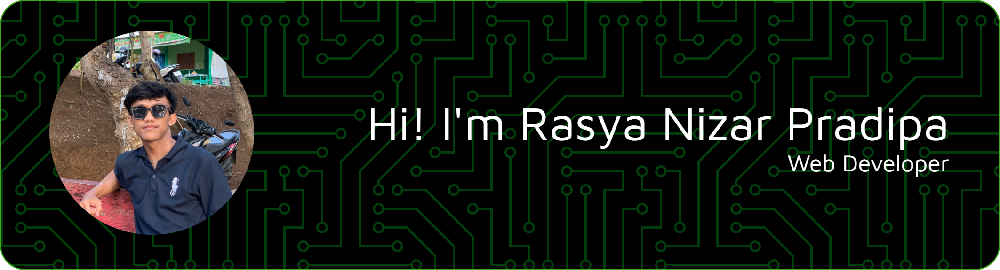

<h3 align="center">Keep Learning, Keep Building | On My Way to Cybersecurity & Professional Web Development </h3>
 

### 👤 About Me

I'm a developer who enjoys working with **HTML**, **CSS**, **PHP**, and **JavaScript**.  
For me, coding is not just a job   it's a passion, especially when accompanied by a cup of **Vietnam Drip Arabica coffee** 😁.

> *"Every expert was once a beginner who refused to give up."*

### 📚 Currently Learning
- Node.js for backend development
- MongoDB for database management
- API integration with PHP & JavaScript

### 🎯 My Developer Journey Goals  
- Gain solid fundamentals in **Cybersecurity** and apply them in real projects 🔐  
- Develop **professional-grade websites** with clean code and responsive design 🌐  
- Build and deploy at least **2 complete web projects** from scratch  
- Learn and implement **best practices** for secure web development  
- Contribute to **open source projects** to sharpen skills and collaborate with other developers  
- Continuously improve problem-solving skills through **weekly coding challenges** 

---

### 🌐 Socials
 

  
  
  

---

### 🖥️ Tech Skills
 

  
  
  
  
  
  
  
  
  
  
  
  
  

---

### 📊 GitHub Stats
 

  
  
  <h3 align="left">🏆 GitHub Trophies</h3>
  

